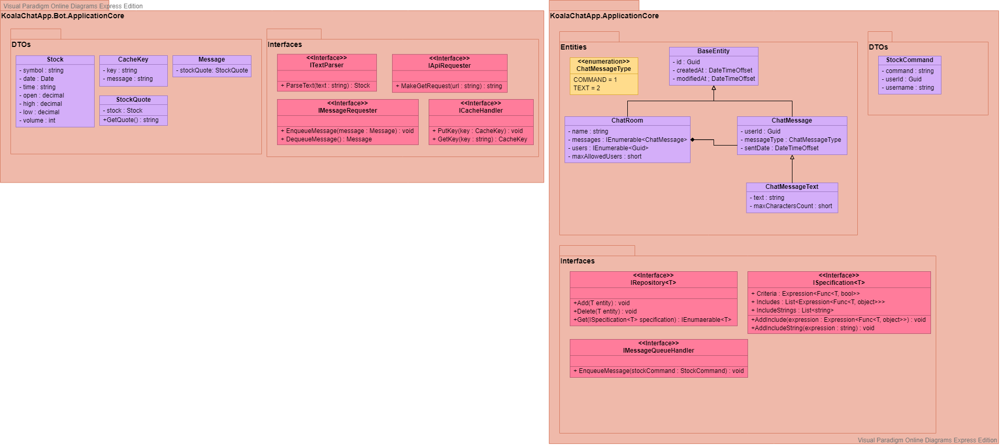
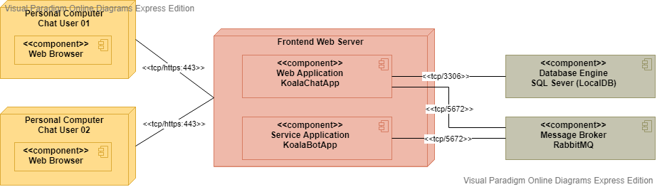

# Koala Chat App
This a simple Chat using SignalR for real time application and applying the best practices on coding.

## Prerrequisites
1. .NET Core 3.1 [Latest] (https://dotnet.microsoft.com/download/dotnet-core/3.1)
2. Docker Desktop (https://www.docker.com/products/docker-desktop)
3. Visual Studio 2015+ (for development)
4. RabbitMQ Docker Image (https://hub.docker.com/_/rabbitmq)
5. SQL Server

## Installation
For the installation, you could use the Powershell script called Install.ps1 which you can found in this repository or follow the steps below on Windows Powershell with Administrator Privileges:

First of all, clone this repository using the following *git* command:

`git clone https://github.com/salucianol/koala-chat-app.git KoalaChatApp`

### RabbitMQ

1. `docker pull rabbitmq:3-management`
2. `docker run -d -P --hostname koala-chat-rabbit --name koala-chat-rabbit -e RABBITMQ_DEFAULT_USER=<PUT_YOUR_ADMIN_USERNAME_HERE> -e RABBITMQ_DEFAULT_PASS=<PUT_YOUR_PASSWORD_HERE> rabbitmq:3-management`

### Koala Chat Bot
1. `cd .\KoalaChatApp\KoalaChatApp.Bot`
2. `dotnet publish -c Release --self-contained false -r win10-x64 -o <PUT_HERE_OUTPUT_PATH>`
3. `sc.exe create KoalaChatAppBot binPath="<PUT_HERE_OUTPUT_PATH>" DisplayName="Koala Chat App Bot"`
4. `sc.exe start KoalaChatAppBot`

### Koala Chat App
1. `cd .\KoalaChatApp\KoalaChatApp.Web`
2. `dotnet publish -c Release -o <PUT_HERE_OUTPUT_PATH>`
3. `cd <PUT_HERE_OUTPUT_PATH>`
4. `dotnet KoalaChatApp.Web.dll`

## UML Diagrams

### Class Diagram

### Deployment Diagram

